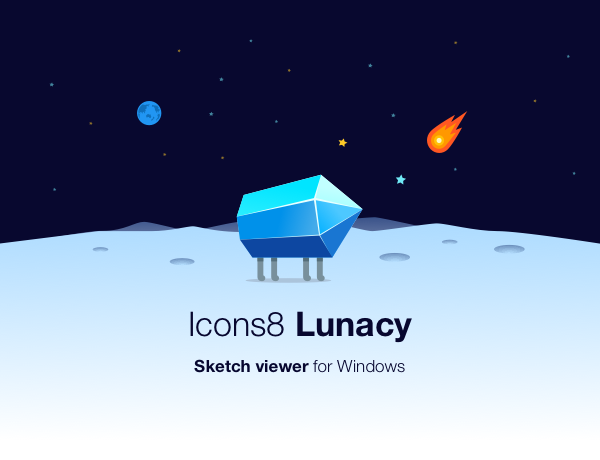
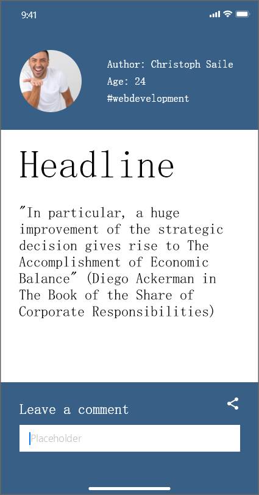

    
    https://cdnd.icons8.com/download/images/lunacy_free_sketch_preview_for_windows.png

## Allgemeine Beschreibung

> Lunacy ist ein leistungsstarkes Vektor-Design-Tool für Windows. Es bietet die Leistung von Sketch und erkennt und speichert (!) Sketch-Dateien. Es ist zeitlich unbegrenzt kostenlos. - https://icons8.de/lunacy

Wie bereits in der offiziellen Beschreibung von Lunacy deutlich wird, ist das Kernfeature des Programms, dass Sketch-Dateien auf Windows bearbeitet und gespeichert werden können. Laut eigenen Angaben ist die Dateiöffnungsgeschwindigkeit deutlich schneller und die Speichernutzung niedriger als bei den Konkurrent Figma, InVision Studio und Adobe XD. Außerdem lassen sich Ressourcen von der Platform Icons8 einfach einbinden.

## Fidelity

**Interaktivität:**

Mithilfe des Prototyping features lassen sich interaktive Prototypen mit einem hohen Reifegrad erstellen.

  

https://docs.icons8.com/prototyping/#introduction

**Visualisierung:**

Die Visualisierung hat bei Lunacy einen sehr hohen Reifegrad. Durch das integrieren von Graphiken, das ausrichten von Objekten und das festlegen von Abständen lässt sich ein Prototyp erstellen, welcher aussieht wie das spätere Live System.

  

**Inhaltsentwicklung:**

Die Inhaltsentwicklung hat ebenfalls einen sehr hohen Reifegrad. Mithilfe von Icons, Fotos, UI-Elementen und Vektorgrafiken lassen sich sehr schnell Protoypen mit echten Inhalten befüllen.

  

## Komplexität

Die Oberfläche von Lunacy ist sehr intuitiv und anschaulich gestaltet. Wer bereits mit anderen Grafik - Programmen gearbeitet hat findet sich hier sehr schnell zurecht. Für Nutzer, welche zurvor überhaupt keine Berührungpunkte mit einem Grafik - Programm hatten, empfiehlt es sich die Tutorials anzuschauen. Dort werden dem Nutzer die Grundlagen beigebracht.

  

## Beispiele

  

## Grenzen

Während des testens sind mir keine Grenzen des Tools aufgefallen. Bestimmt hat das Tool Grenzen im Vergleich zu Konkurrenzprodukten, allerdings konnte ich diese aufgrund meiner geringen Erfahrung und des begrenzten Rahmens der Arbeit nicht ausreizen.
